# Roadmap

High-level implementation order in **~1–3 day** slices for a solo builder. Interfaces and simulated arb come before crawling real data.

**Implementation status:** track and mark phases done under [`spec/roadmap/`](roadmap/README.md) (one file per phase). Update that board when each phase is finished.

```mermaid
flowchart LR
  P0[P0_repo_skeleton] --> P1[P1_exchange_interfaces]
  P1 --> P2[P2_fake_ticks]
  P2 --> P3[P3_arb_strategy_paper]
  P3 --> P4[P4_risk_fees_latency]
  P4 --> P5[P5_pnl_admin_audit]
  P5 --> P6[P6_backtest_sim]
  P6 --> P7[P7_crawl_warehouse]
  P7 --> P8[P8_hl_grvt_adapters]
  P8 --> P9[P9_paper_on_live_feeds]
  P9 --> P10[P10_monitoring_hardening]
```

## Phases

### P0 — Repo skeleton

- **Status:** [done](roadmap/p0.md)
- **Goal**: Go module layout, package stubs, constitution linked from README.
- **Done when**: `go` packages exist as empty/skeleton dirs; `spec/` is discoverable.
- **Skip**: adapters, strategies, infra.

### P1 — Core interfaces

- **Status:** [done](roadmap/p1.md)
- **Goal**: Define `Exchange`, Strategy, Risk, PnL (and related) interfaces only. `Exchange` must fit crypto books **and** prediction-market venues (e.g. Polymarket outcomes)—instrument/symbol types stay venue-agnostic. Strategy/Risk/PnL contracts must allow a **multi-leg hedge** (prediction up/down + HL/GRVT) later without breaking the crypto-only arb path.
- **Done when**: compile-time contracts exist; no real venue or market data.
- **Skip**: implementations beyond stubs needed to compile; no Polymarket adapter or hedge strategy yet.

### P2 — Fake tick feed

- **Status:** [done](roadmap/p2.md)
- **Goal**: Deterministic dual-venue fake ticks + clock for tests.
- **Done when**: fake books/ticks drive a consumer without network I/O.
- **Skip**: crawl, warehouse, live websockets.

### P3 — Arb strategy (paper)

- **Status:** [done](roadmap/p3.md)
- **Goal**: Detect gaps on fake dual-venue books; emit paper buy/sell decisions.
- **Done when**: simulated arb produces paper orders for multi-symbol config (BTCUSD first).
- **Skip**: fee/latency gates (next phase), live feeds.

### P4 — Risk gates (miss-more doctrine)

- **Status:** [done](roadmap/p4.md)
- **Goal**: Reject trades that do not survive worst-case fees, latency, and partial-fill assumptions.
- **Done when**: risk module blocks negative-edge paper trades; preferred behavior is miss opportunities.
- **Skip**: live capital, exchange-specific quirks beyond modeled costs.

### P5 — PnL and admin audit

- **Status:** [done](roadmap/p5.md)
- **Goal**: Persist paper orders and PnL; basic audit via logs or simple store.
- **Done when**: every paper trade is reconstructable (order store + PnL).
- **Skip**: polished UI, visualization charts.

### P6 — Backtest simulation

- **Status:** [done](roadmap/p6.md)
- **Goal**: Replay ticks/books through Strategy/Risk → PnL; winning rate + distribution `(symbol, gap, volumes, exchanges, time)` for Risk calibration.
- **Done when**: Simulation accepts market input + strategy, outputs PnL; Analyzer reports win rate/distribution.
- **Skip**: rich Visualization Module (CSV is enough); production ML.

### P7 — Crawl and warehouse

- **Goal**: Minimal crawl stubs + local warehouse (SQLite/Parquet) to persist ticks for backtest.
- **Done when**: crawled sample data lands in warehouse and can feed P6.
- **Skip**: full historical coverage, multi-cloud storage.

### P8 — Hyperliquid + GRVT read adapters

- **Goal**: Live/read quote and tick adapters behind `Exchange` for Hyperliquid and GRVT. **Verify and lock API contracts first**, then map both venues into the same internal book/tick types.
- **Done when**:
  - Contract notes below are implemented (or amended if docs changed).
  - Both adapters satisfy `Exchange` for configured symbols (symbol map in config).
  - Strategy / risk / PnL still do not import vendor SDKs.
- **Skip**: real order placement (`/exchange` on HL; GRVT `create_order` / trading WS).

#### API contracts (verified from official docs — re-check at implement time)

**Hyperliquid** — [API docs](https://hyperliquid.gitbook.io/hyperliquid-docs/for-developers/api/)

| Concern | Contract |
|---------|----------|
| REST base | Mainnet `https://api.hyperliquid.xyz`; testnet `https://api.hyperliquid-testnet.xyz` |
| WS | Mainnet `wss://api.hyperliquid.xyz/ws`; testnet `wss://api.hyperliquid-testnet.xyz/ws` |
| Market info | `POST /info` (e.g. L2 book snapshot, meta); JSON body selects request type |
| Primary arb feed | WS `subscribe` → `{ "type": "l2Book", "coin": "<coin>" }` → channel `l2Book` |
| Book payload | `WsBook`: `{ coin, levels: [bids[], asks[]], time }` where level = `{ px, sz, n }` (strings for px/sz) |
| Alt feeds | `bbo`, `trades`, `allMids`, `candle` — use if L2 not needed |
| Symbol form | Perp coin name from `meta` (e.g. `BTC`); spot often `@{index}` or `PURR/USDC` |
| Auth (read) | Public market data; no cookie for book/trades |
| Rate limits | Documented per IP / WS (e.g. connection & subscription caps) — bake into Connection module |

**GRVT** — [API docs](https://api-docs.grvt.io/)

| Concern | Contract |
|---------|----------|
| Market REST | Prod `https://market-data.grvt.io` (`full/v1/...` or `lite/v1/...`); also staging/testnet hosts |
| Market WS | Prod `wss://market-data.grvt.io/ws/full` (or `/ws/lite`) |
| Trade hosts | Separate `trades.*` hosts — **out of scope for P8 reads** |
| Request style | REST: **POST only**; WS: **JSON-RPC 2.0** (`method` / `params` / `id`) |
| Instrument | Readable names e.g. `BTC_USDT_Perp` via `full/v1/instrument` / `all_instruments` |
| Book snapshot | `POST full/v1/book` with `instrument` + `depth` (`10` / `50` / `100` / `500`) |
| Book stream | Subscribe stream e.g. `v1.book.s` with feed selectors like `BTC_USDT_Perp@500-100-10` |
| Full vs lite | Full uses long field names; lite uses short keys (`i`, `r`, …) — prefer **full** for P8 clarity |
| Auth (market) | Public market-data endpoints for books/tickers; trading WS needs cookie + `X-Grvt-Account-Id` (later phases) |
| Time | Event times in **unix nanoseconds** on streams — normalize to internal clock |

#### Adapter normalization duties (P8)

1. **Symbol map**: config maps HHLD symbol (e.g. `BTCUSD`) → HL `coin` (`BTC`) and GRVT `instrument` (`BTC_USDT_Perp`). Do not hard-code in strategy.
2. **Book unify**: both venues → internal `{ bids[], asks[], ts }` with decimal prices/sizes; HL `px`/`sz` strings and GRVT book levels must parse the same way.
3. **Clock unify**: HL `time` (ms-style per docs) vs GRVT ns → one internal timestamp representation.
4. **Reconnect**: on WS drop, resubscribe and treat next book as fresh snapshot (do not apply stale deltas across reconnect).
5. **Contract gate**: before merge, smoke-test live subscribe for one symbol on each venue and assert payloads match the tables above; if docs diverge, update this section in the same PR as the adapter.

### P9 — Paper on live feeds

- **Goal**: Run arb + risk + PnL on live market data; still paper-only fills.
- **Done when**: paper trading loop runs against HL + GRVT feeds with auditable orders.
- **Skip**: real capital, production SLAs.

### P10 — Monitoring and hardening

- **Goal**: Trace mismatched/lost orders; deploy on one medium instance.
- **Done when**: structured logs/trace IDs support order forensics; single-instance deploy documented.
- **Skip**: Kubernetes, multi-region.

## Later (explicitly after P10)

- Visualization polish (PnL over time / alpha charts)
- Live trading gate (real orders) behind strict risk and kill switches
- **Polymarket `Exchange` adapter** (read/paper first): map markets/outcomes (up/down, Yes/No) into the same book/tick model; verify API contract in-phase like P8
- **Prediction ↔ crypto hedge strategy**: paper multi-leg trades (prediction up/down on Polymarket hedged with Hyperliquid or GRVT); shared hedge id; miss-more risk on both legs (fees, latency, leg failure / unpaired exposure)
- Prediction strategy as a second method (forecasting; distinct from venue adapter and from hedge)
